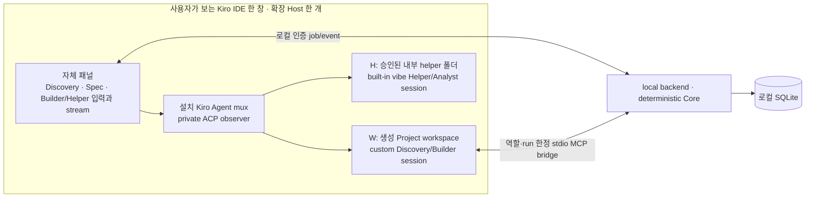

# T19-N Kiro IDE 내장 Agent 어댑터 인계 계약 (실험안)

이 문서는 [PROJECT_BRIEF](../../PROJECT_BRIEF.md)의 실제 Builder 작업 중 독립 Helper 질문, 보수적 사용자 Evidence와 다음 개인화 철학에 사용자가 추가한 **한 IDE 창** 조건을 적용한 현재 실험 경로의 책임 분리를 정리한다. 결과와 최신 합격 판정은 계속 갱신되는 [T19 마지막 8시간 실측 보고서](T19_NATIVE_IDE_ONLY_LAST_8H_20260915.md)가 기준이다. 이 문서는 T19 완료 선언이나 기존 CLI/Crew 경로 폐기 결정이 아니다.

**지원 경계:** 관찰·실행한 조합은 Kiro IDE 1.0.437 / Kiro Agent 1.0.794의 Extension Development Host다. 어댑터는 설치본의 **비공개 로컬 Agent mux/ACP observer**를 사용하며 공개·안정 API 또는 배포 가능한 제품 계약으로 취급할 수 없다. 버전·workspace trust·역할 mode 선택·권한 형태가 바뀌면 실패하도록 pin한다. Dev Host는 검증한 배포 형태이지 제품에 두 번째 IDE 창이나 디버그 Host가 반드시 필요하다는 뜻은 아니다.

이 보고서의 **한 창 W+H route는** 실험 backend를 `VIBE_NATIVE_SINGLE_WINDOW_BUILTIN_H=1`로 기동했을 때만 선택한다. 이 opt-in이 없으면 과거의 별도 H host 경로를 같은 한 창 검증 결과로 해석해서는 안 된다. `VIBE_NATIVE_PERSISTENT_DIAGNOSTICS=1`은 Core receipt 계측용으로 켠 플래그이며 제품 기능의 필수 조건은 아니다.

H는 같은 IDE 창 안의 별도 session `cwd`이며 별도 사용자 창, 숨긴 두 번째 Dev Host 또는 외부 모델 실행기가 아니다. Core/backend/SQLite와 stdio MCP bridge는 로컬 **비-Agent** 프로세스로 남는다. 따라서 “Agent CLI 없이 실행”과 “프로세스가 하나뿐임”은 서로 다른 주장이다.

## 소유권과 필수 계약

| 소유자 | 유지할 책임과 통과 조건 |
| --- | --- |
| TypeScript Core · backend | Project/Spec/Task/Decision의 ID·revision·상태 전이, 실제 Decision 요청과 사용자 선택 적용, Live Context, Episode/Evidence Proposal 수락·거절, Concept State, 개인화, SQLite를 단독 소유한다. UI나 Kiro session 응답은 Core 성공 receipt를 대신하지 않는다. |
| 패널 · frontend client | 한 창에서 Builder와 Helper의 독립 입력·run stream·stop, Discovery/Spec/History/Decision을 동일 Core lineage로 표시한다. 중단·실패·재시작 뒤에는 저장된 Core 상태를 읽고, Agent 출력과 합성 USER 입력의 출처를 구분한다. |
| IDE host adapter | 현재 workspace/window의 Kiro session 수명, 역할·mode/model ACK, protected H 선준비와 재검증, native permission 선택, stream redaction, 소유 cancel terminal 확인, 실패 시 pair 폐기를 담당한다. Core의 학습 판정이나 사용자 Decision을 대신하지 않는다. |
| 한 run의 bridge | backend 발급 Project/Task 또는 Discovery Session/correlation/role/tool subset과 loopback bearer를 검증·전달한다. Kiro의 stdio MCP 광고 형태만 변환하고, Agent 입력은 Core가 다시 검증한다. H에는 Builder bearer나 mutation tool을 건네지 않는다. |

1. **시작·바인딩:** backend가 Core snapshot을 확인한 뒤 role·run·Project·Task/Discovery Session·correlation·workspace가 묶인 job을 발급한다. Discovery/Builder용 bearer는 해당 run의 bridge descriptor에만 있고 job 종료 시 무효화한다. native mode 선택은 `session/new`의 옵션과 `session/set_config_option`의 반환 `currentValue`로 확인한다. prompt는 versioned canonical Agent 정책을 사용하며 relay는 validated Core context를 전달한다.
2. **H → W 준비 순서:** 같은 창의 H Helper와 Analyst를 **W Builder `session/new` 전에** 준비한다. H는 bootstrap `ask`에서 소유 synthetic policy check의 `reject_always`로 session `all: deny`를 만든 뒤 `vibe` mode로 전환한다. session rule과 `fs_read`·`fs_write`·shell·MCP·subagent 등 explain 결과, 최종 catalog, cloud pull/config, hook, memory/knowledge flag와 소유 session log를 각각 확인한다. 별도 barrier 뒤 W가 열리면 두 H session을 다시 증명하고 **그 다음에만** H 모델 prompt를 허용한다. 불명확한 permission/tool call/설정 변화는 실행 실패다. 남는 shell introspection category는 이 설치본에서 소유 H의 process-manager 조회로만 해석되며 범용 read/shell 권한으로 간주하지 않는다.
3. **실행·스케줄:** W custom Builder는 생성 workspace에서 제한된 read/write/shell과 role-bound Core 도구로 실제 작업한다. H built-in ChatAgent는 Core가 만든 현재 Helper context 또는 Episode를 prompt에 싣고, H의 예상 밖 native tool call은 즉시 취소·실패시킨다. 같은 Host에서 W와 H prompt가 겹칠 수 있지만 H Helper와 Analyst는 현재 어댑터가 직렬화한다. H prompt 시작과 W의 새 `session/new`는 공유 MCP pool/cloud refresh 때문에 서로 배타적으로 조정한다. Helper의 새 질문이 Builder terminal 이전에 답해도 Builder 작업과 Core mutation은 계속되어야 한다.
4. **stream·provenance:** native text는 줄 경계와 길이 제한 안에서 workspace/secret redaction 후 패널로 전달하고, tool event는 raw input·bearer 대신 분류된 상태·Core 결과·안전한 상대 경로·제한된 출력만 보낸다. 이것은 실제 작업의 관찰 가능한 stream이며 Kiro 원본 transcript 전체와 동등하다고 주장하지 않는다. UI의 Agent 문장, 실제 USER 입력, Core receipt와 Evidence acceptance는 별개 출처다.
5. **종료·복구:** stop은 `session/cancel` 요청만으로 성공이 아니다. 같은 소유 session의 `cancelled` terminal ACK가 오면 confirmed cancel, 늦은 `end_turn`·RPC 오류·미확인은 fail-closed다. Builder는 기존 backend 660초 lease 안에서 최대 590초 또는 lease 종료 15초 전 soft cancel을 요청하고 native 600초 hard RPC guard를 유지한다. **확인된 예산 종료도 Builder run은 `FAILED`이고 Core Task는 `ACTIVE`/미완료로 남는다.** 이 경우 protected H pair를 닫는다. 미확인 종료도 pair를 닫고, backend/worker가 idle임을 확인한 뒤 새 pair를 준비해야 한다. H에서는 사용자 stop 또는 Analyst lease soft cancel처럼 **소유 terminal이 확인된 취소**(`NATIVE_H_CANCELLED_CONFIRMED`)만 lifecycle이 같은 pair의 재사용을 허용한다. 그 외 H 실패는 정해진 역할 폐기 또는 pair 폐기 경계로 처리한다.

## 현재 소스 지도

| 경계 | 소스 |
| --- | --- |
| 패널과 역할별 UI·명령 | [`examples/kiro-panel/src/extension.cjs`](../../examples/kiro-panel/src/extension.cjs), [`media/panel.html`](../../examples/kiro-panel/media/panel.html), [`media/panel.js`](../../examples/kiro-panel/media/panel.js) |
| job claim, H pair 선준비, Helper/Analyst 직렬화, event/stop | [`examples/kiro-panel/src/native-worker.cjs`](../../examples/kiro-panel/src/native-worker.cjs), [`protected-lifecycle.cjs`](../../examples/kiro-panel/src/protected-lifecycle.cjs) |
| private observer, role·policy·catalog·memory gate, native turn/cancel | [`examples/kiro-native-host/native-client.cjs`](../../examples/kiro-native-host/native-client.cjs), [`native-protected-tools.cjs`](../../examples/kiro-native-host/native-protected-tools.cjs), [`native-memory-attestation.cjs`](../../examples/kiro-native-host/native-memory-attestation.cjs), [`native-cloud-pull-attestation.cjs`](../../examples/kiro-native-host/native-cloud-pull-attestation.cjs), [`examples/kiro-panel/src/native-permission.cjs`](../../examples/kiro-panel/src/native-permission.cjs) |
| Core job/context/lease와 role-bound bearer | [`apps/local-backend/src/native-agent-relay.ts`](../../apps/local-backend/src/native-agent-relay.ts), [`native-core-binding.ts`](../../apps/local-backend/src/native-core-binding.ts), [`packages/application/src/application-service.ts`](../../packages/application/src/application-service.ts) |
| stdio MCP 역할 범위와 Core receipt | [`scripts/native-core-stdio-bridge.mjs`](../../scripts/native-core-stdio-bridge.mjs), [`apps/mcp-server/src/role-server.ts`](../../apps/mcp-server/src/role-server.ts) |
| 정책 source of truth와 빌드 | [`docs/agent-prompts/`](../agent-prompts/), [`scripts/build-kiro-panel.mjs`](../../scripts/build-kiro-panel.mjs), [`examples/kiro-panel/package.json`](../../examples/kiro-panel/package.json) |

## 제품화 전에 남는 경계

- 일반 VSIX 설치, Windows, 다른 Kiro/Agent 버전에서 이 private observer와 session별 정책·catalog·취소 동작은 확인되지 않았다. 먼저 지원 가능한 공개 인터페이스 또는 버전별 capability 계약을 확보해야 한다. Dev Host 검증을 제품 배포 증거로 옮겨 쓰지 않는다.
- 현재 extension/bundle은 저장소 상대 경로로 bridge·canonical prompt·패널 asset·내부 패키지 결과물을 찾는다. 독립 설치물에는 이 파일들과 실행 가능한 Node·의존성·연결 설정을 명시적으로 패키징하고 설치 후 경로, macOS/Windows에서 재검증해야 한다.
- IDE Builder shell은 실제 Node 26.4.0, Core/backend 검증은 Node 24.19.0이었다. 생성 TypeScript 앱의 Node 24 적합성은 별도 검증한다. 직접 파일·cwd·명령 guard는 있지만 생성 앱의 `pnpm`/`npm` script/test가 우회적으로 W 밖 파일을 쓰는 것을 막는 OS sandbox는 아직 증명하지 못했다.
- 전체 제품 합격에는 실제 Decision의 사용자 적용과 결과 반영, 생성 앱의 완료·실행, 깨끗한 사용자 Evidence의 다음 답변/Discovery 반영이 이어져야 한다. 합성 USER 발언은 실제 사용자 학습 효과의 증거가 아니다. 각 항목의 최신 상태와 남은 검증은 [실측 보고서](T19_NATIVE_IDE_ONLY_LAST_8H_20260915.md)를 참조한다.
